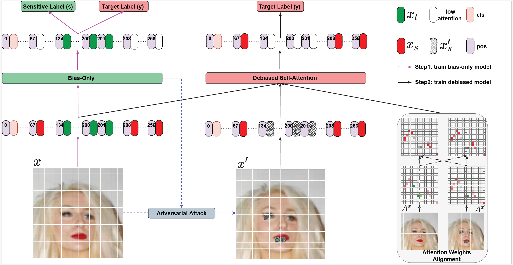

<div align='center'>
 
# [Fairness-aware Vision Transformer via Debiased Self-Attention](https://arxiv.org/pdf/2301.13803)

<table align="center">
  <tr>
    <td align="center"> 
       
      <br>
      <em style="font-size: 18px;">  <strong style="font-size: 18px;">Figure 1:</strong> The DAS framework.</em>
    </td>
  </tr>
</table>
</div>

Welcome to the official repository for the paper, [Fairness-aware Vision Transformer via Debiased Self-Attention](https://arxiv.org/pdf/2301.13803). This repository contains the code for the experiments used in the paper.

## Abstract
Vision Transformer (ViT) has recently gained significant attention in solving computer vision (CV) problems due to its capability of extracting informative features and modeling long-range dependencies through the attention mechanism. Whereas recent works have explored the trustworthiness of ViT, including its robustness and explainability, the issue of fairness has not yet been adequately addressed. We establish that the existing fairness-aware algorithms designed for CNNs do not perform well on ViT, which highlights the need for developing our novel framework via Debiased Self-Attention (DSA). DSA is a fairness-through-blindness approach that enforces ViT to eliminate spurious features correlated with the sensitive label for bias mitigation and simultaneously retain real features for target prediction. Notably, DSA leverages adversarial examples to locate and mask the spurious features in the input image patches with an additional attention weights alignment regularizer in the training objective to encourage learning real features for target prediction. Importantly, our DSA framework leads to improved fairness guarantees over prior works on multiple prediction tasks without compromising target prediction performance.

## Code structure
The code is structured as follows:
```
-- Train the vanilla ViT 
    -- vanilla.ipynp
-- Train the bias-only ViT
    -- bias-only.ipynp
-- Adversarial attack against the bias-only ViT
    -- adversarial attack against bias-only model.ipynp
-- Attention mask (AM) 
    -- attention mask (AM).ipynp
-- Debiased self-attention (DSA)
    -- debiased self-attention (DSA).ipynp
-- Baselines
    -- baselines/DANN.ipynp
    -- baselines/LAFTER.ipynp
    -- baselines/MFD.ipynp
    -- baselines/MMD.ipynp
    -- baselines/TADeT.ipynp
```

## Cite This Work
```
@article{qiang2023fairness,
  title={Fairness-aware vision transformer via debiased self-attention},
  author={Qiang, Yao and Li, Chengyin and Khanduri, Prashant and Zhu, Dongxiao},
  journal={arXiv preprint arXiv:2301.13803},
  year={2023}
}
```
